# go_task4
# 目录结构
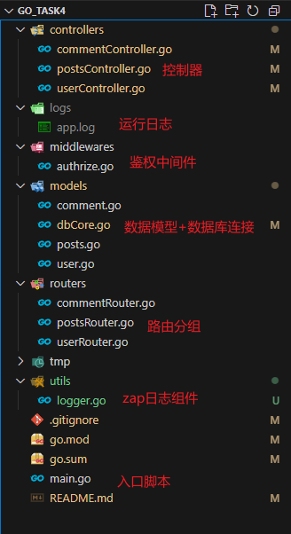

# 项目简介
- 开发库：gin + gorm + mysql + golang-jwt + zap
- 可视化数据库工具：Navicat Premium 17
- 接口调试工具：Postman

# 运行步骤
1. 修改下图中 mysql 连接为自己的可用连接
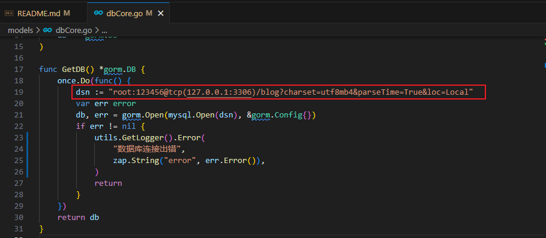

2. 默认使用数据库名为 blog，需手动创建
   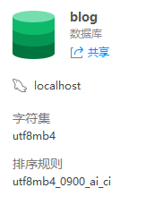

3. 根目录运行终端命令启动项目：go run .

# 自测展示（按步骤进行）
## 1. 用户注册
- 参数不完整，注册失败
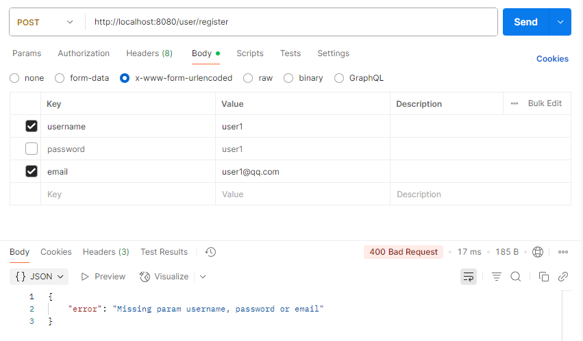

- 注册成功（重复注册 user2）
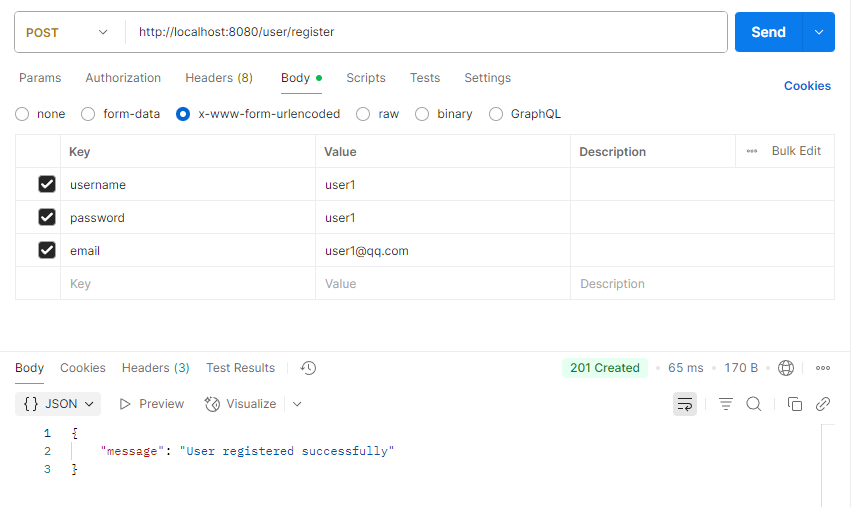

## 2. 用户登录
- 密码错误，登录失败
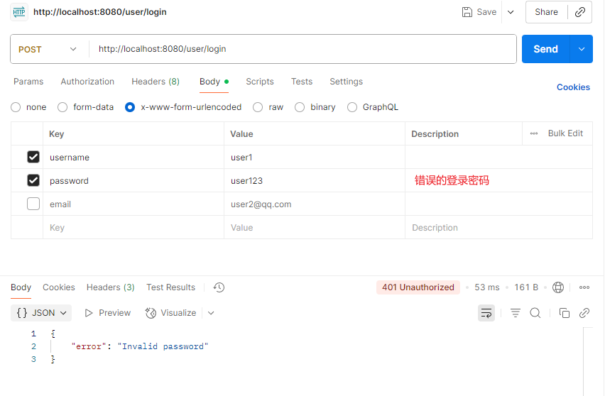

- 正确参数，登录成功，下发授权token
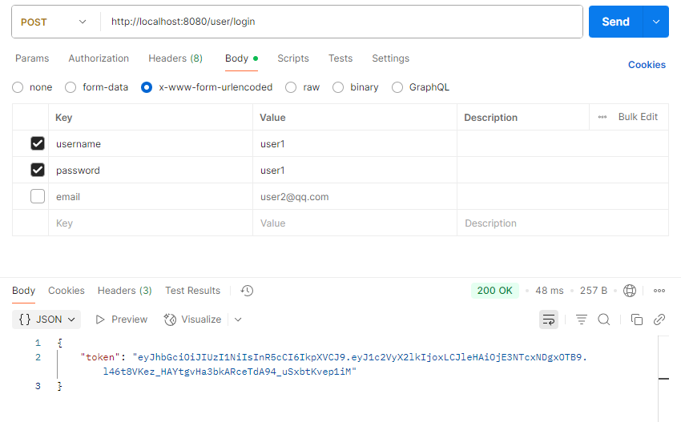

- 后续需要鉴权的 api，token 通过 Headers 下的 Authorization 携带

## 3. 文章创建
- 未授权情况
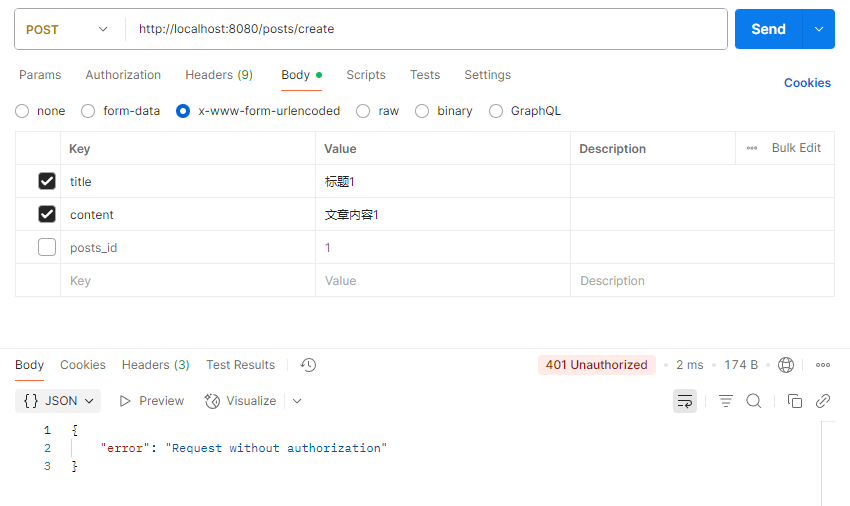

- 成功授权，参数正确（重复创建：标题2+文章内容2，标题3+文章内容3）
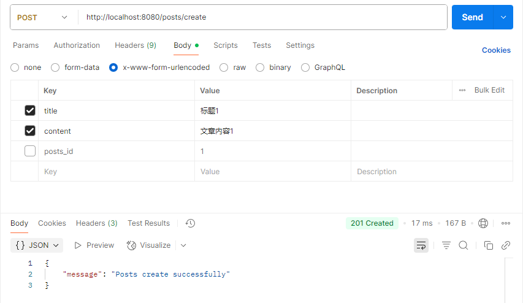

## 4. 文章更新
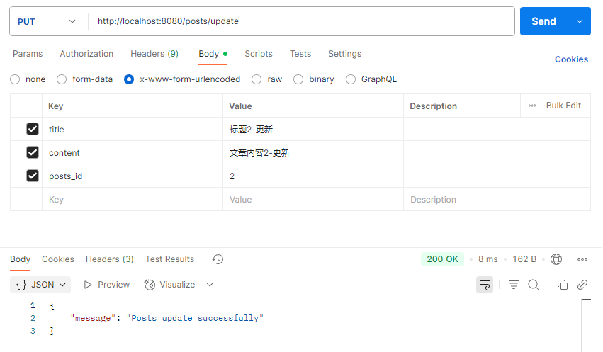

## 5. 评论添加
- 添加成功（重复添加：文章1-评论2）
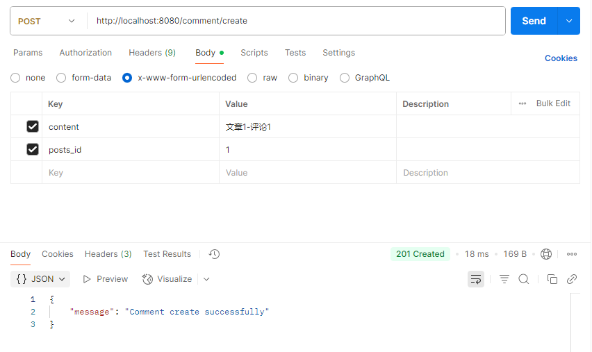

## 6. 评论查询
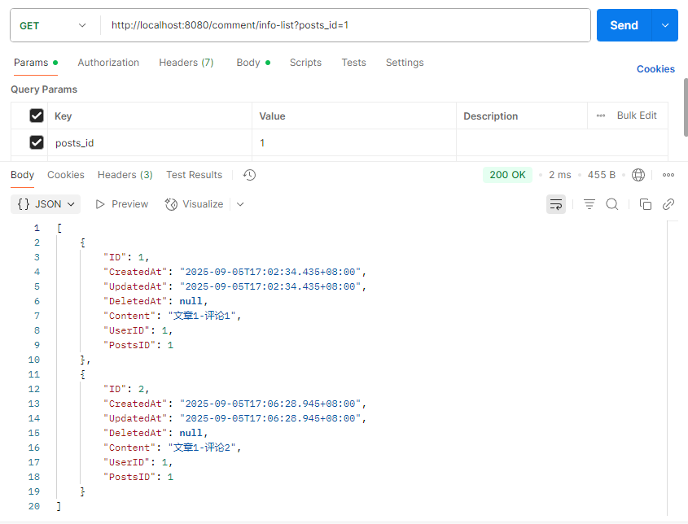

## 7. 文章查询
- 查询列表
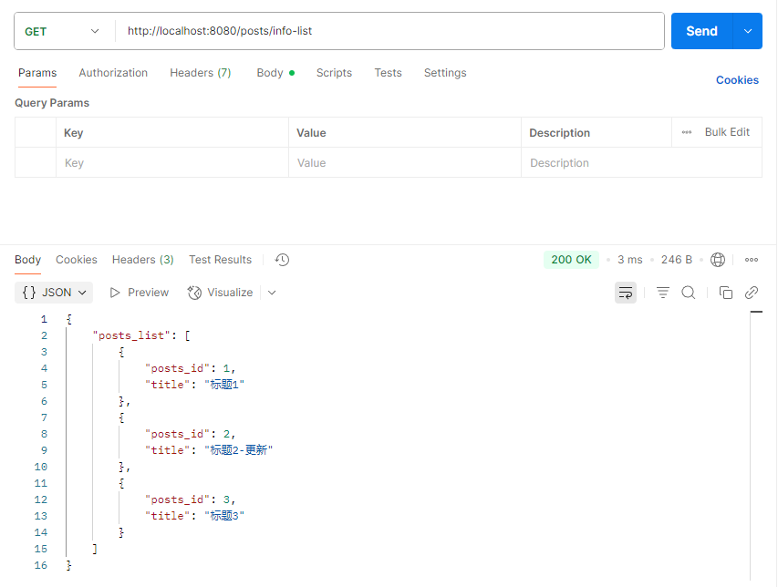

- 指定文章查询
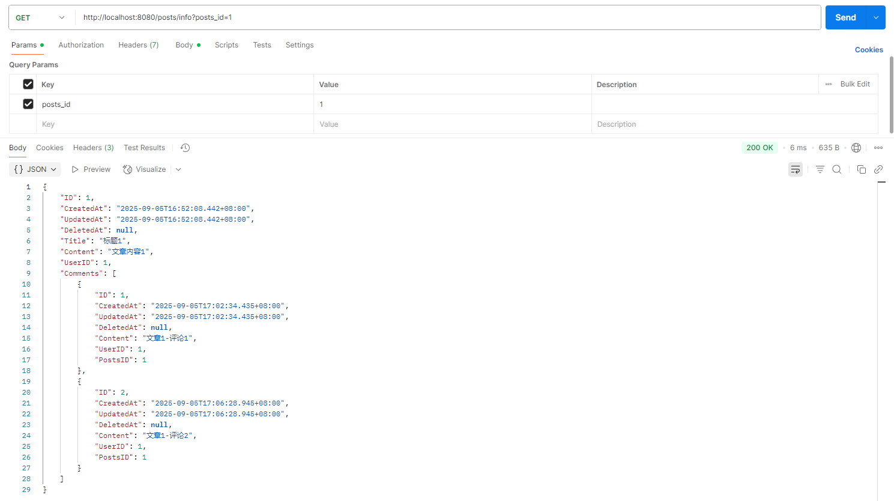

## 8. 文章删除前，数据库内容
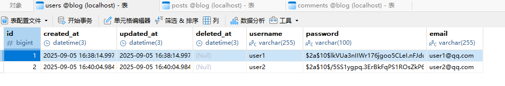
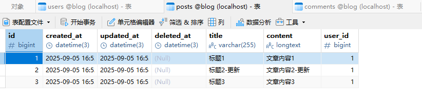
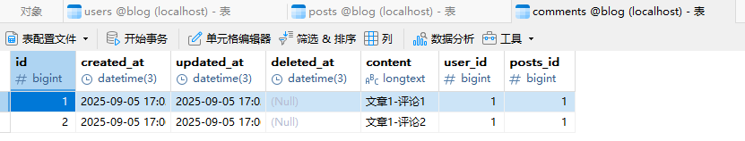

## 9. 文章删除
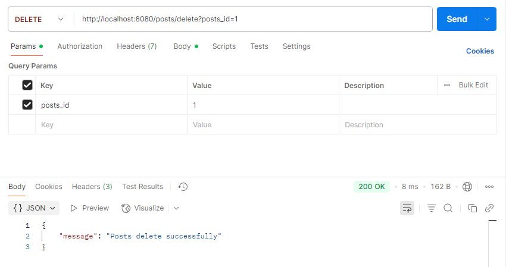

## 10. 文章删除后，数据库内容
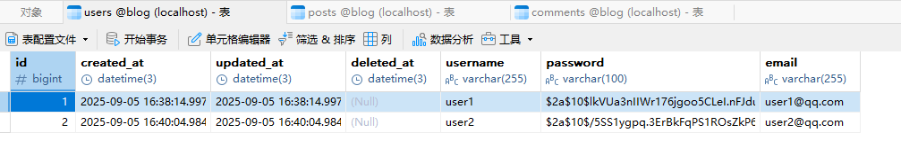
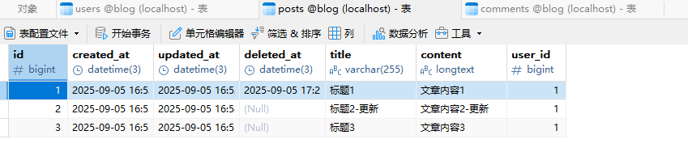
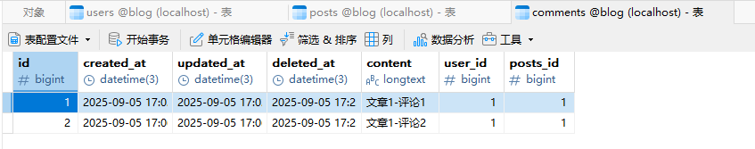